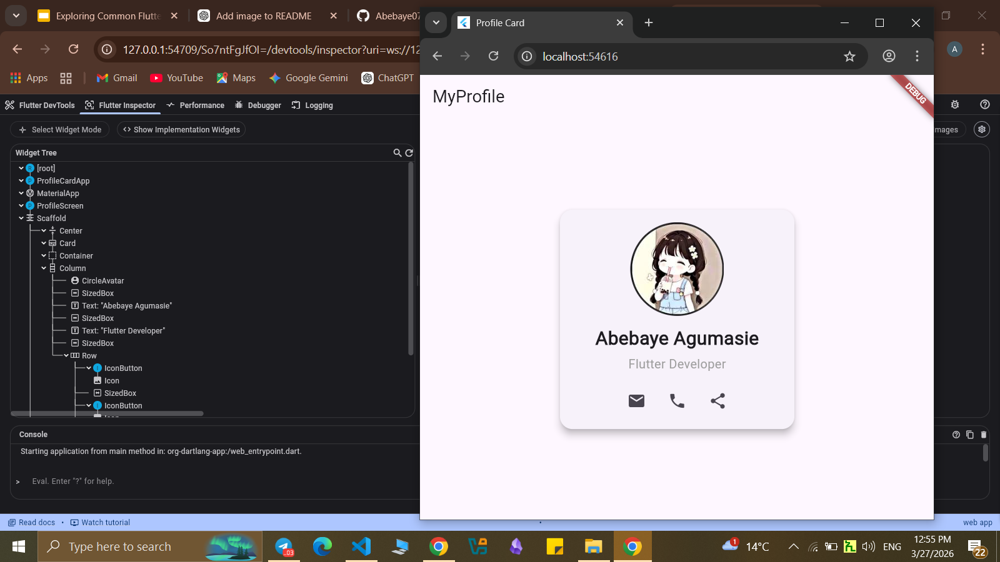
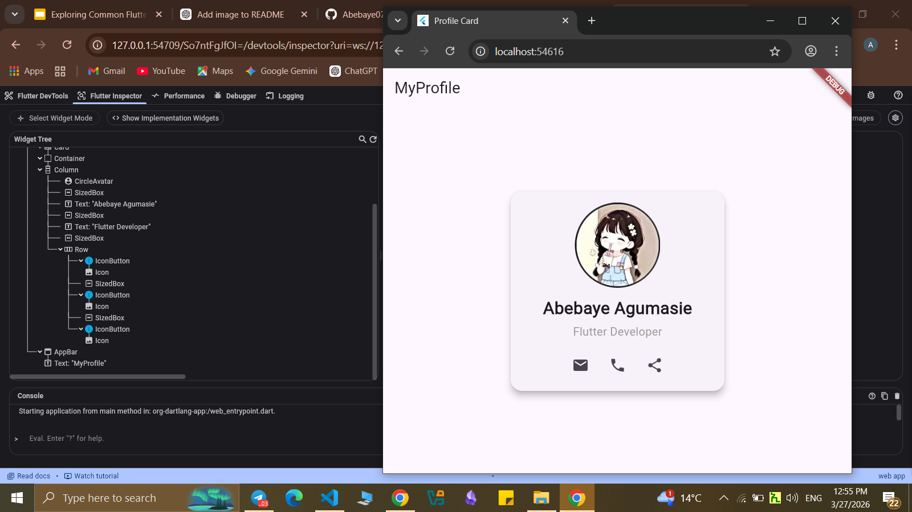

# Flutter Widgets Lab Assignments

## Lab 1: Profile Card

### Screenshots of the app and Widget tree

## Lab2: Bottom Nav

### Screenshots of the app and Widget tree

## Lab3: Catalog

## Lab4: Registration form

